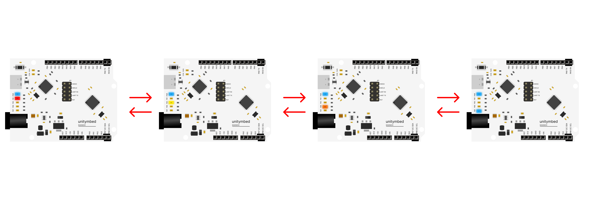

# N32G031_LED_SEQUENCE — Sequential Blink (On-board LEDs)

An introductory project designed to teach basic GPIO (General Purpose Input/Output) control using the **N32G031** microcontroller[cite: 1, 2]. This project expands on the basic "Hello World" by controlling the on-board LEDs sequentially across pins **PB1, PB3, PB6, and PB7**. It serves as an excellent tool for understanding sequential logic and timing functions without the need for any external wiring. This project is fully optimized for cross-platform workflows using UnityMbed.

---

## Wiring

✅ **No External Wiring Required**

This project utilizes the LEDs already integrated into the UnityMbed Starter Kit board. You can locate the LED cluster on the board (near the port), which is clearly labeled with pins **PB7, PB6, PB3, and PB1**.

---

## Behaviour & Execution

Once powered on and flashed with the code, the microcontroller will execute the following loop continuously to create a "chasing" effect[cite: 1, 2]:
1. Set **PB1** to ON, wait via delay, then set to OFF.
2. Set **PB3** to ON, wait via delay, then set to OFF.
3. Set **PB6** to ON, wait via delay, then set to OFF.
4. Set **PB7** to ON, wait via delay, then set to OFF, then restart the cycle.

---

## Learning & AI Extension Ideas

* **Digital Outputs:** Understand the concepts of HIGH (ON) and LOW (OFF) states and how to manipulate multiple pins.
* **The Speed Challenge:** Encourage students to modify the `delay(400000)` value inside the code.
  * What happens if they change the delay to `50000`? Does the sequence look smoother and faster?
* **Knight Rider Effect:** Can they prompt the AI to modify the loop sequence to make the LEDs bounce back and forth (PB1 -> PB3 -> PB6 -> PB7 -> PB6 -> PB3 -> PB1)?
* **Concurrent Blinking:** Try asking the AI to write the logic to turn ON PB1 and PB7 at the same time, followed by PB3 and PB6.

---

## Build and Flash (Universal Cross-Platform)
1. **Open Project:** Open this project folder directly in the IDE.
2. **Build & Flash:** Simply click the **Build** and **Flash** buttons on the interface.

---
Part of the [UnityMbed](https://github.com/GRB-UNITYMBED) N32G031 example set.